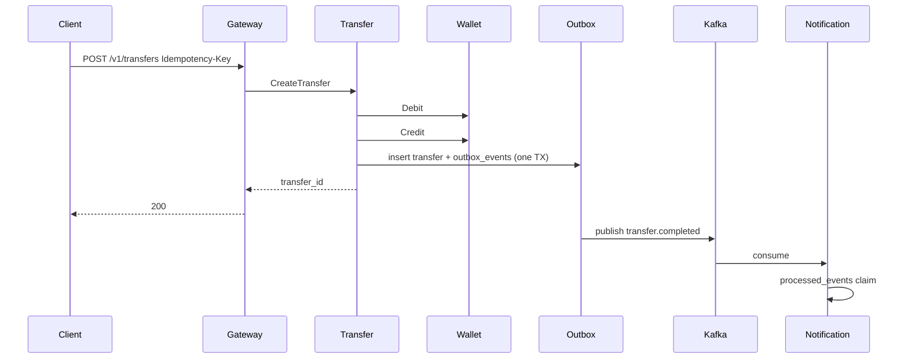

# Architecture

## Services

- **gateway** — REST edge, JWT auth, fans out to gRPC services
- **identity** — users, password hashing, JWT issuance
- **wallet** — double-entry ledger, optimistic locking
- **transfer** — idempotent transfers, transactional outbox → Kafka
- **notification** — Kafka consumer with processed_events idempotency

## Patterns

Transactional outbox, idempotency keys, optimistic concurrency, W3C trace propagation
across HTTP, gRPC, and Kafka headers. Kafka publish retries with DLQ fallback.
Wallet gRPC client uses a consecutive-failure circuit breaker.

## Money

All amounts are `int64` minor units (e.g. kopecks). No floating point.

## Transfer sequence

## Observability

- OpenTelemetry traces/metrics via OTLP → Collector → Jaeger / Prometheus
- Jaeger UI: http://localhost:16686
- Grafana: http://localhost:3000
- Graceful shutdown on SIGINT/SIGTERM for all services
